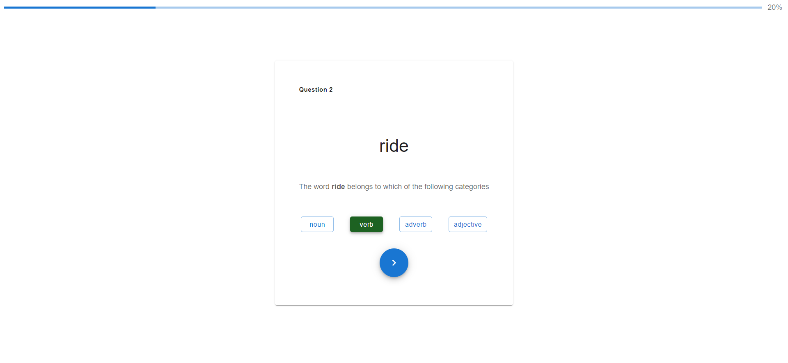
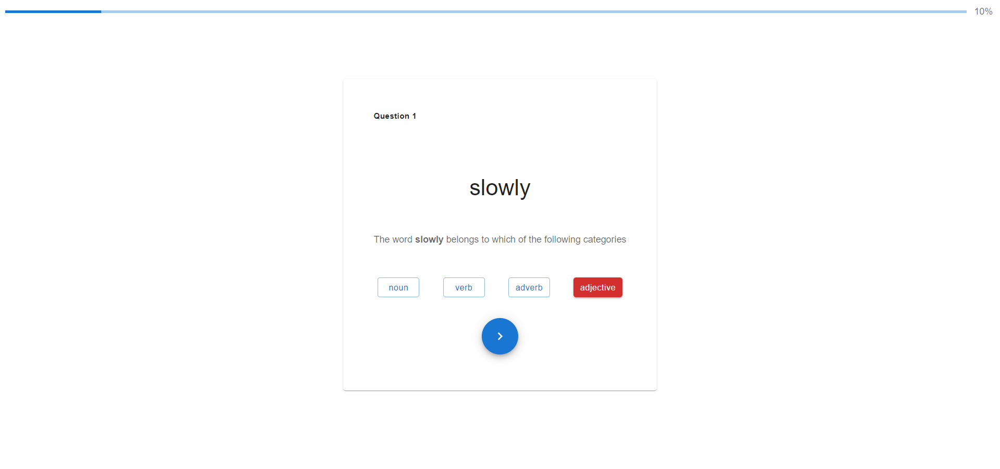
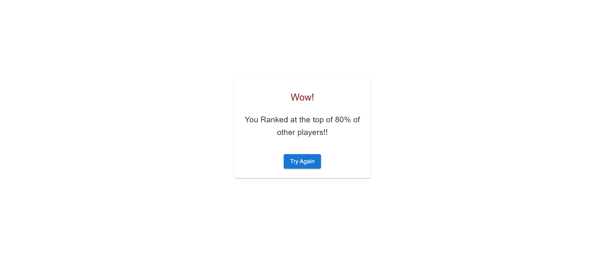

## JavaScript Developer Task
> MERN-Stack interactive website using React.js, node.js, and Express.js that helps the students practice categorizing a
set of words according to their part of speech.

## Content
1) [Tools](#Tools)
2) [How to Setup](#how-to-setup)
3) [Scripts to Run](#scripts)
4) [How it Works](#how-it-works)
5) [Preview](#preview)

## Tools
- Frontend
    - React.js
    - JavaScript
    - Material UI
- Backend
    - Node.js
    - TypeScript
    - Express.js

## How to Setup
1) Clone the repository
2) Inside the root folder run `npm run install`

## Scripts
| Command  | Action |
| ------------- | ------------- |
| `npm run start:api`  | start the Node.js server om port 3000 |
| `npm run start:frontend`  | start the frontend server on port 4000|
| `npm run build:api`  | build the server-side code and generate js code inside `dist` folder|
| `npm run build:frontend`  | build the client-side code|
| `npm run install`  | install the dependancies of both client-side and server-side|

## How it Works
- After installing dependancies, start both the client and server side `npm run start:api` `npm run start:frontend`
- Open the client-side URL `localhost:4000`
- Answer the 10 questions
- Your rank among other users will be displayed.

## Preview

